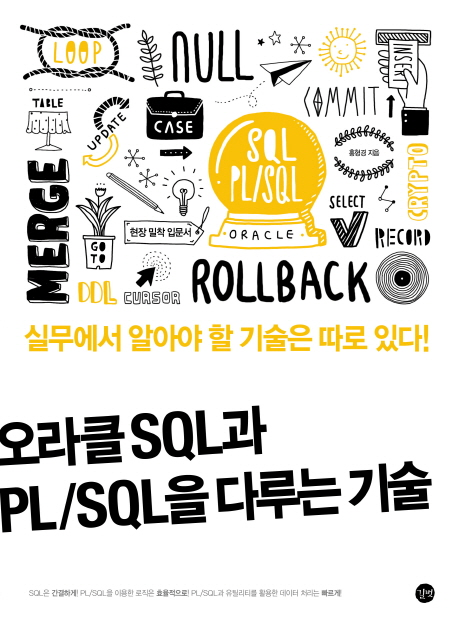

# SQL_edu

> 교재 '오라클 SQL과 PL/SQL을 다루는 기술 (길벗)'를 활용하여 학습한 내용입니다.
 
 

## I. 오라클 프로그래밍의 시작, SQL

### 2장 데이터베이스를 구성하는 객체 살펴 보기
01. 데이터베이스 객체의 개요
    - 데이터베이스 객체의 종류
02. 테이블
    - 테이블 생성
    - 데이터 타입
    - NULL
    - 제약조건
    - 테이블 삭제
    - 테이블 변경
    - 테이블 복사
03. 뷰
    - 뷰 생성
    - 뷰 삭제
04. 인덱스
    - 인덱스 생성
    - 인덱스 삭제
05. 시노님
    - 시노님 생성
    - 시노님 삭제
06. 시퀀스
    - 시퀀스 생성
    - 시퀀스 삭제
07. 파티션 테이블

### 3장 SQL 문장 살펴 보기
01. SELECT문
02. INSERT문
    - 기본 형태
    - 컬럼명 기술 생략 형태
    - INSERT ~ SELECT 형태
03. UPDATE문
04. MERGE문
05. DELETE문
06. COMMIT과 ROLLBACK, TRUNCATE
07. 의사컬럼
08. 연산자
09. 표현식
10. 조건식

### 4장 SQL 함수 살펴 보기
01. 숫자 함수
02. 문자 함수
03. 날짜 함수
04. 변환 함수
05. NULL 관련 함수
06. 기타 함수

### 5장 그룹 쿼리와 집합 연산자 알아 보기
01. 기본 집계 함수
02. GROUP BY 절과 HAVING 절
03. ROLLUP 절과 CUBE 절
    - ROLLUP(expr1, expr2, …)
    - CUBE(expr1, expr2, …)
04. 집합 연산자
    - UNION
    - UNION ALL
    - INTERSECT
    - MINUS
    - 집합 연산자의 제한사항
    - GROUPING SETS 절

### 6장 테이블 사이를 연결해 주는 조인과 서브 쿼리 알아 보기
01. 조인의 종류
    - 현장의 노하우_조인 종류를 다 알아야 할까?
02. 내부 조인과 외부 조인
    - 동등 조인
    - 세미 조인
    - 안티 조인
    - 셀프 조인
    - 외부 조인
    - 카타시안 조인
03. ANSI 조인
    - ANSI 내부 조인
    - ANSI 외부 조인
    - CROSS 조인
    - FULL OUTER 조인
04. 서브 쿼리
    - 연관성 없는 서브 쿼리
    - 연관성 있는 서브 쿼리
    - 인라인 뷰

### 7장 복잡한 연산 결과를 추출해 내는 고급 쿼리 다루기
01. 계층형 쿼리
    - 계층형 구조
    - 계층형 쿼리
    - 계층형 쿼리 심화학습
    - 계층형 쿼리 응용
02. WITH절
    - 개선된 서브 쿼리
    - 순환 서브 쿼리
03. 분석 함수와 window 함수
    - 분석 함수
    - window 절
    - window 함수
    - 기타 분석 함수
04. 다중 테이블 INSERT
    - 여러 개의 INSERT문을 한 번에 처리
    - 조건에 따른 다중 INSERT

 

## II. 복잡한 비즈니스 로직을 처리하는 PL/SQL

### 8장 PL/SQL의 구조와 구성요소 살펴 보기
01. PL/SQL 기본 구조
    - 블록
    - 익명 블록
02. PL/SQL 구성요소
    - 변수
    - 상수
    - 연산자
    - 주석
    - DML문
    - PRAGMA 키워드
    - 라벨

### 9장 PL/SQL 제어문과 함수, 프로시저 알아 보기
01. PL/SQL 제어문
    - IF문
    - CASE문
    - LOOP문
    - WHILE문
    - FOR문
    - CONTINUE문
    - GOTO문
    - NULL문
02. PL/SQL의 사용자 정의 함수
    - 함수 생성
    - 함수 호출
03. 프로시저
    - 프로시저 생성
    - 프로시저 실행
    - 매개변수 디폴트 값 설정
    - OUT, IN OUT 매개변수
    - RETURN문

### 10장 예외처리와 트랜잭션 알아 보기
01. 예외처리
    - 예외처리 구문
    - SQLCODE, SQLERRM을 이용한 예외정보 참조
    - 시스템 예외
    - 사용자 정의 예외
    - 시스템 예외에 이름 부여하기
    - RAISE와 RAISE_APPLICATION_ERROR
02. 트랜잭션
    - COMMIT과 ROLLBACK
    - SAVEPOINT

### 11장 커서, 레코드, 컬렉션 살펴 보기
01. 커서
    - 묵시적 커서와 커서 속성
    - 명시적 커서
    - 커서와 FOR문
    - 커서 변수
    - 커서 표현식
02. 레코드
    - 사용자 정의형 레코드
    - 테이블형 레코드
    - 커서형 레코드
    - 중첩 레코드
03. 컬렉션
    - 컬렉션의 종류
    - 컬렉션 메소드
    - 사용자 정의 데이터 타입
    - 컬렉션 타입별 차이점과 그 활용법
    - 컬렉션 타입별 비교

 

## III. 업무 효율을 높이는 실전 PL/SQL 프로그래밍

### 12장 함수와 프로시저 관리의 효율을 높이는 패키지
01. 패키지
02. 패키지 해부
    - 패키지 구조
    - 패키지 사용
    - 타 프로그램에서 패키지 호출
03. 패키지 데이터
    - 상수와 변수 선언
    - 커서
    - 레코드와 컬렉션
04. 기타 패키지 특징
    - PRAGMA SERIALLY_REUSABLE 옵션
    - 오버로딩

### 13장 실행 시점에 생성되어 수행되는 동적 SQL
01. 동적 SQL이 필요한 이유
02. NDS
    - EXECUTE IMMEDIATE문
    - OPEN FOR문
    - 성능 향상을 위한 다중 로우 처리
03. DBMS_SQL
    - DBMS_SQL 처리 순서
    - DBMS_SQL 기본 활용
    - DBMS_SQL 응용 활용

### 14장 임시 테이블과 TABLE 함수
01. 오라클도 지원 가능한 임시 테이블
02. 임시 테이블
    - 트랜잭션 GTT
    - 세션 GTT
    - 기타 GTT의 특징
03. TABLE 함수
    - 사용자 정의 테이블 함수
    - 파이프라인 테이블 함수

### 15장 오라클 잡과 스케줄러
01. DBMS_JOB
    - DMBS_JOB 패키지의 개념
    - DBMS_JOB의 서브 프로그램
    - DBMS_JOB의 단점과 한계
02. DBMS_SCHEDULER 패키지
    - 오라클 스케줄러
    - 오라클 스케줄러의 구성요소
    - DBMS_SCHEDULER의 서브 프로그램
03. DBMS_SCHEDULER를 이용한 스케줄링 처리
    - 잡 객체만을 이용한 스케줄링
    - 프로그램, 스케줄 객체를 이용한 스케줄링
    - 외부 프로그램 수행
    - 체인

 

## IV. 실무 능력을 높이는 오라클 프로그래밍 기법

### 16장 PL/SQL 성능 향상 기법
01. 일괄 처리
    - BULK COLLECT
    - FORALL문
02. 함수 성능 향상
    - RESULT CACHE 기능의 개요
    - RESULT CACHE 함수 사용
03. 병렬 처리
    - 병렬 쿼리
    - 병렬 DML
    - 병렬 처리 시 주의사항

### 17장 소스 관리와 디버깅
01. 소스 관리
    - 데이터 딕셔너리
    - 소스 백업
02. 디버깅 기법
    - DBMS_OUTPUT.PUT_LINE 프로시저
    - 소요 시간 출력
    - 로그 테이블
    - 기타
03. 동적 쿼리 디버깅
04. DML문을 실행한 데이터 추적
    - 변경되거나 삭제된 데이터 추적
    - RETURNING INTO 절을 이용한 디버깅

### 18장 프로시저를 통한 이메일 전송
01. SMTP 메일 전송
    - SMTP의 개념
    - SMTP 명령어를 이용한 메일 전송
02. UTL_SMTP를 이용한 메일 전송
    - 메일 전송을 위한 사전준비 사항
    - UTL_SMTP 패키지의 타입과 서브 프로그램
    - UTL_SMTP를 이용한 메일 전송
    - HTML 메일 보내기
    - 첨부파일 보내기
03. UTL_MAIL을 이용한 메일 전송
    - UTL_MAIL 패키지의 서브 프로그램
    - UTL_MAIL 패키지를 사용한 메일 전송

### 19장 데이터 암호화와 나만의 유틸리티 프로그램
01. 데이터 암호화
    - 암호화의 개념
    - DBMS_CRYPTO 패키지 해부
    - 암호화 실습
02. 나만의 유틸리티 프로그램
    - 소스 검색
    - 참조 객체 검색
    - 테이블 레이아웃 출력
    - 컬럼 값을 세로로 출력
    - 이메일 전송
    - 비밀번호 관리
    - 데이터 암호화